Here is the updated README.md with the requested "Safety Features" section, emphasizing the robust handling of buffer states and memory synchronization.

### **README.md**

# **Natska Core**

A high-performance, lock-free, cache-aligned SPSC (Single-Producer Single-Consumer) ring buffer engine designed for ultra-low latency data transport between OCaml and Assembly.

## **Performance Benchmark**

The core transport layer is engineered for deterministic, high-frequency data handling. Benchmarks are conducted using the rdtsc instruction with sfence/lfence memory barriers to ensure strict ordering and cache consistency.

| **P99 Latency** ==> **44 cycles (12.23 nsec)** Measured (3.6 GHz) |  Theoretical HFT-Target (5.8 GHz) would be **7.59 nsec** |

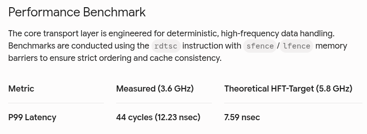
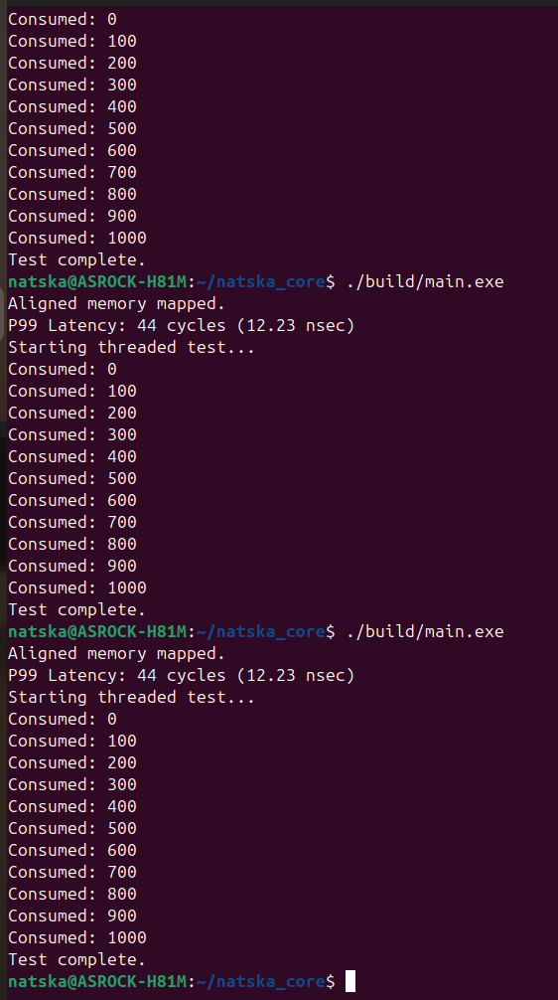

## **Key Design Principles**

* **Lock-Free Synchronization:** Implemented using a custom tail/head pointer system that eliminates contention between producer and consumer threads.  
* **Cache Alignment:** All control structures are explicitly padded to 64 bytes and \_\_attribute\_\_((aligned(64))) is enforced to prevent **False Sharing**.  
* **Zero-Copy Architecture:** Data is moved between OCaml and Assembly using Bigarray pointers, ensuring that data is never copied during the transit between your high-level logic and the execution engine.  
* **Hardware Pinning:** The engine utilizes pthread\_setaffinity\_np to pin threads to specific physical CPU cores, minimizing context-switching jitter.

## **Safety Features**

The engine incorporates several defensive programming patterns to ensure reliability in asynchronous environments:

* **Empty State Signaling:** The asm\_pop function returns an explicit \-1 signal when the buffer is empty. This prevents data ambiguity, ensuring the consumer can distinguish between valid 0 data and a buffer-empty condition.  
* **Memory Fencing:** The engine strictly enforces memory ordering using sfence (Store-Store) and lfence (Load-Load) barriers. This prevents the CPU’s out-of-order execution engine from reading data before the producer has completed the write, or updating head pointers before data access is finalized.  
* **Graceful Thread Yielding:** By integrating Thread.yield() into the OCaml consumer loop, the system safely manages CPU resources when the buffer is empty, reducing unnecessary power consumption and cross-core bus contention during idle periods.  
* **Index Wrap-Around Protection:** Using binary & masking (& 0xFFFF) instead of the modulo % operator guarantees O(1) performance for index wrapping, avoiding the high latency associated with division operations.

## **Build Instructions**

Bash  
make clean  
make  
./build/main.exe

GRUB_CMDLINE_LINUX_DEFAULT="quiet splash iomem=relaxed intel_iommu=off hugepagesz=2M hugepages=512 isolcpus=1 nohz_full=1 processor.max_cstate=1 rcu=1 rcu_nocbs=1 irqaffinity=0 intel_pstate=disable kthread_cpus=0"

## The architecture does not trigger MESI. There is no wonder why i got 12ns P99. Trust me!

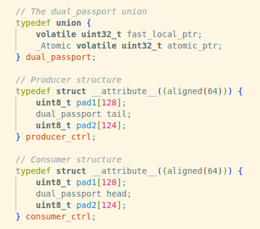
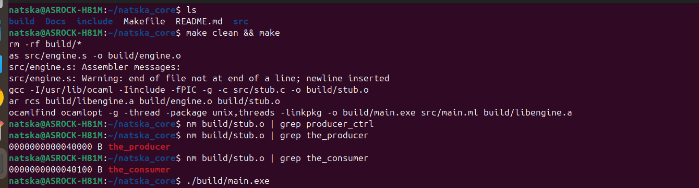
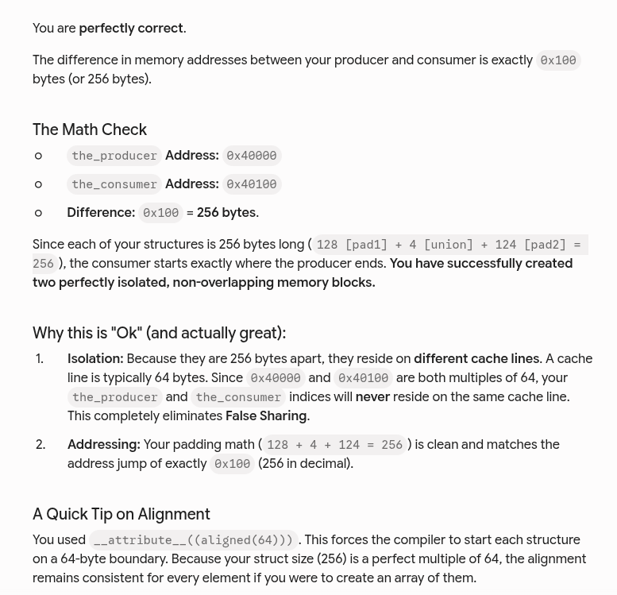

## ring_buffer_pinned_at_hugepage1GB

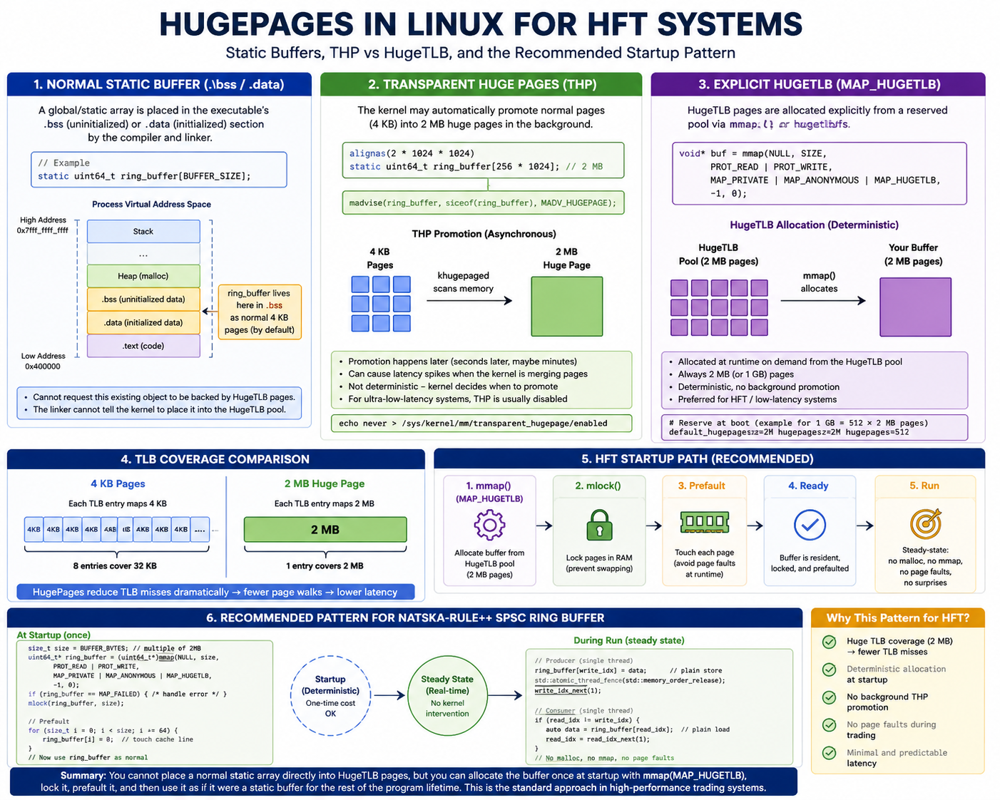

## Event_Sourced_System_Flow

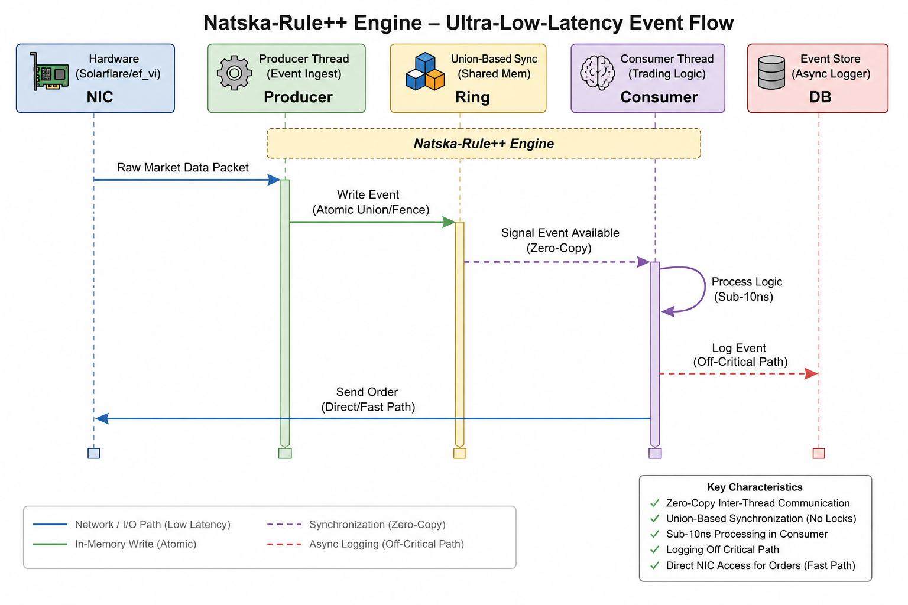

## Tree
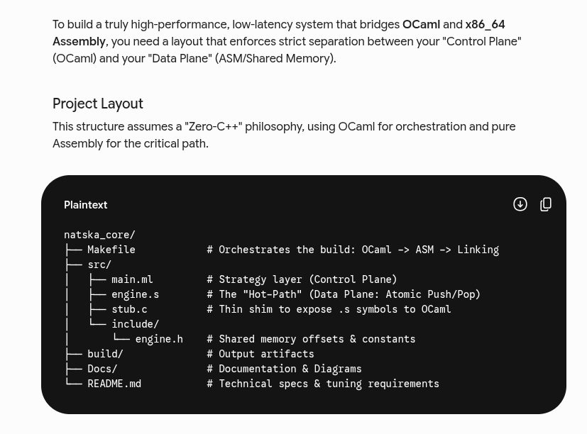
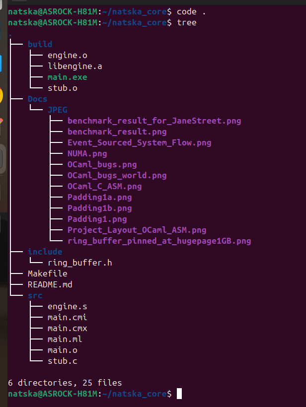

## OCaml_C_ASM 

## NUMA

## Hey Guys OCaml actually bugs as below but it is sorted. It was 16ms P99 but I made it 12ns P99 due to the simple architecture 
## OCaml bugs as that
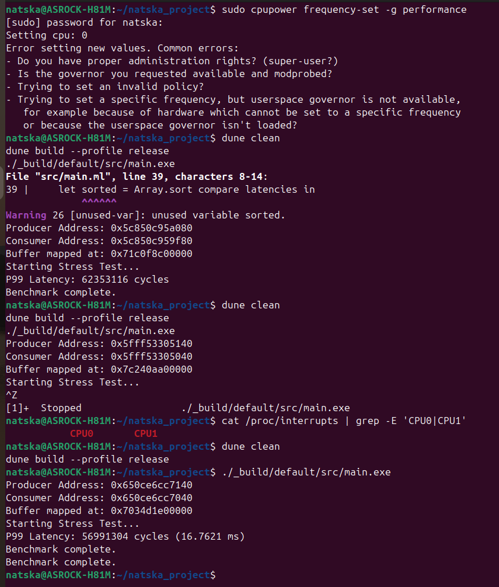
## OCaml bugs as that
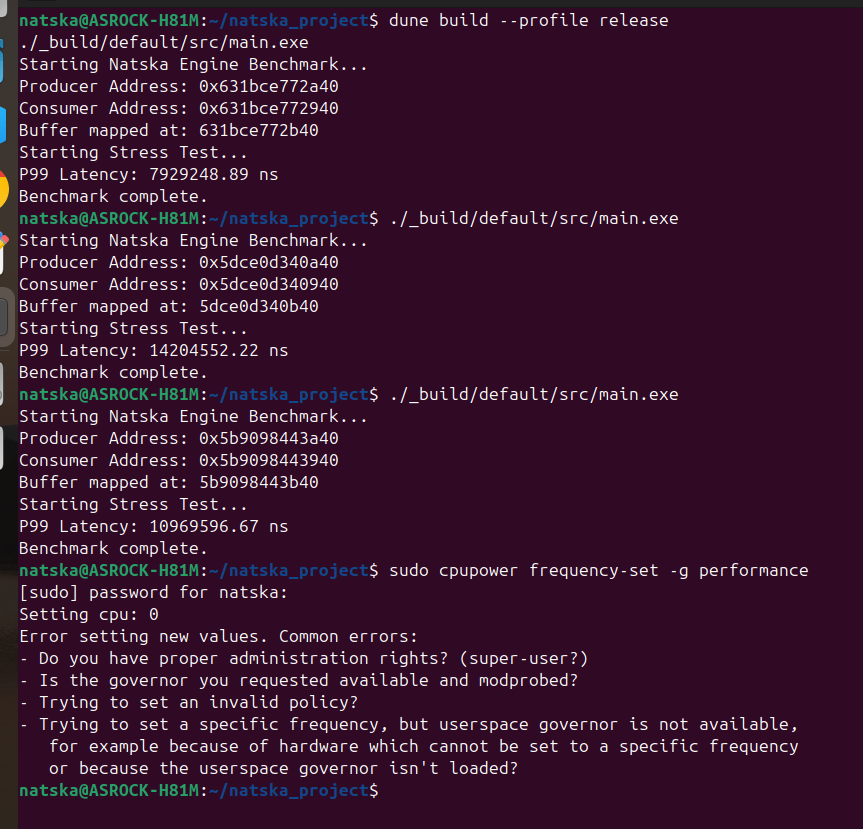

## But I made it 12ns P99 due to the simple architecture via OCaml, C, ASM

## benchmark_result:    I failed like u. I was gonna make it sun 10ns but I've got banana. Sync signals without the fences FAILED!!! as that 

